## FlutterGithub


### 用Flutter实现的一款界面精美、功能较全、体验良好的Github客户端。支持多语言、换肤等功能。代码简单易懂且有充分的注释，很适用于学习Flutter。

## 界面展示

<div align:left;display:inline;>

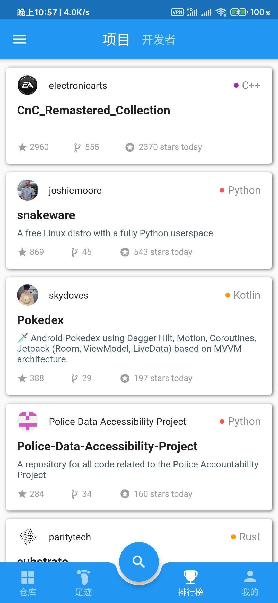
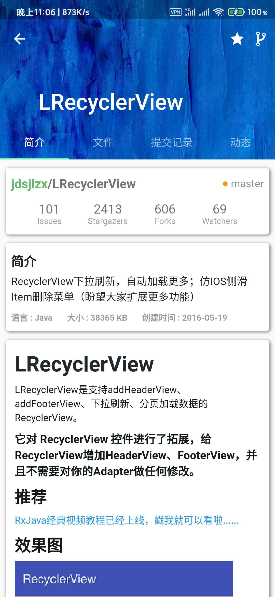

</div>
<div align:left;display:inline;>

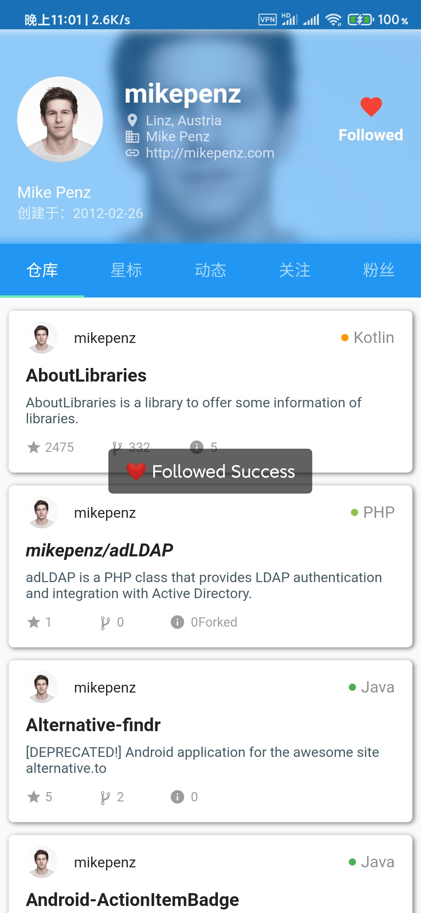
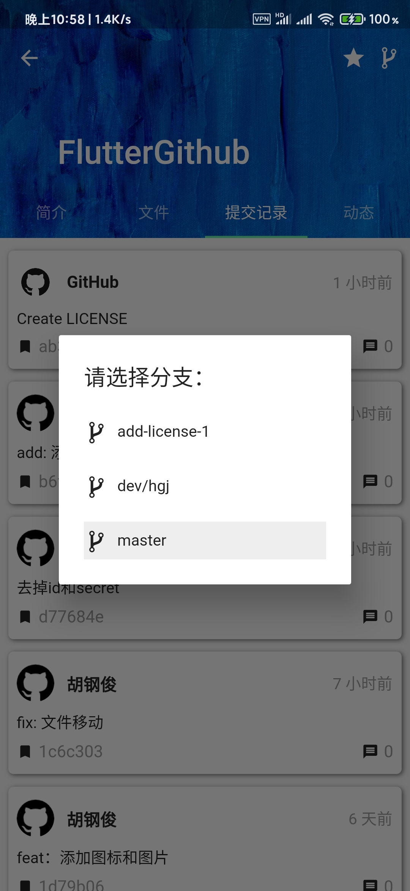
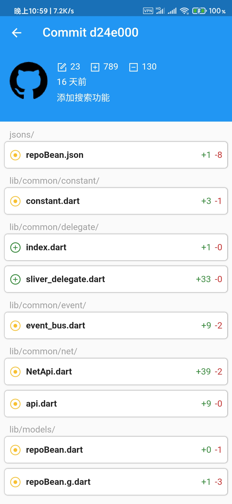
</div>
<div align:left;display:inline;>
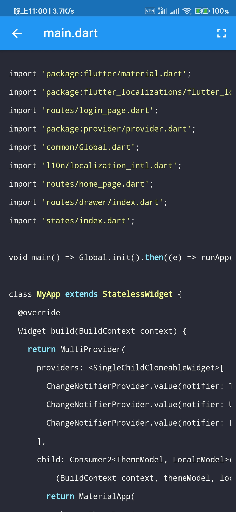
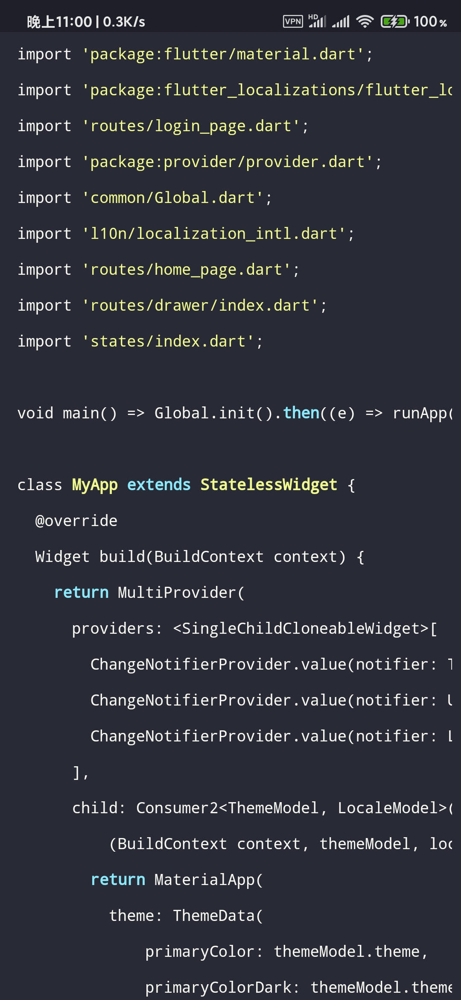
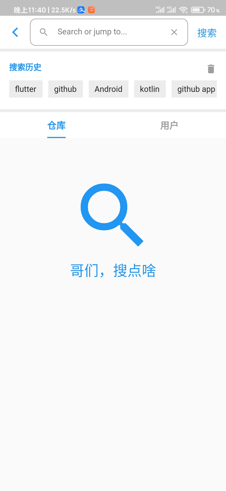
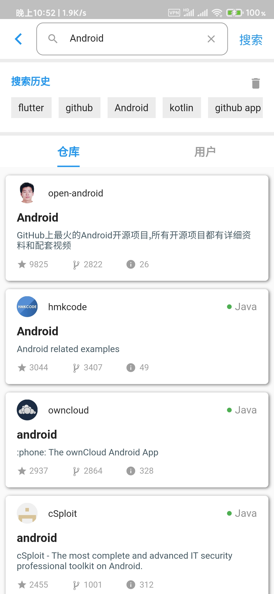
</div>

## 下载体验
扫码下载apk进行体验：


## 功能特性
- **登陆页和首页：**

- **换肤功能：**

- **搜索功能：**
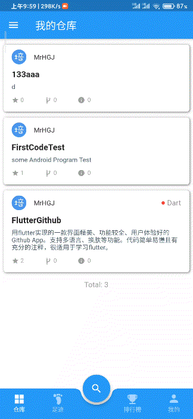
- **浏览源码：**

- **项目详情：**

- **个人详情：**


## 开始使用
- 1. 配置好flutter环境；
- 2. clone本项目：
```
$ git clone https://github.com/MrHGJ/FlutterGithub.git
```
-  3. 注意点：需要注册一个Github的OAuth application，替换项目中的`clientId`和`clientSecret`（位置：**./lib/common/constant/ignore.dart**）；
申请地址：https://github.com/settings/applications/new 信息可以随便填写，没有什么具体要求。例如下图所示，填完后提交即可得到client_id和client_secret；
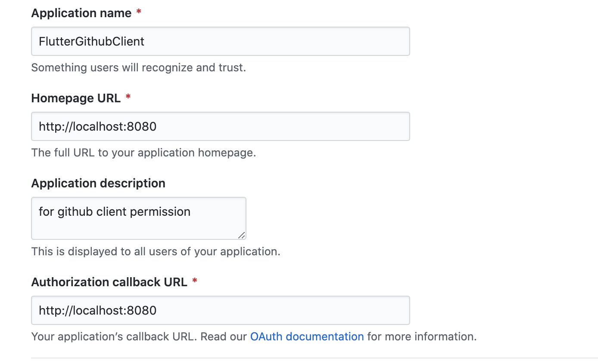
- 4. 大功告成，直接运行即可；
- 5. 登录用github用户名和密码（暂不支持邮箱登陆）。

## 代码结构
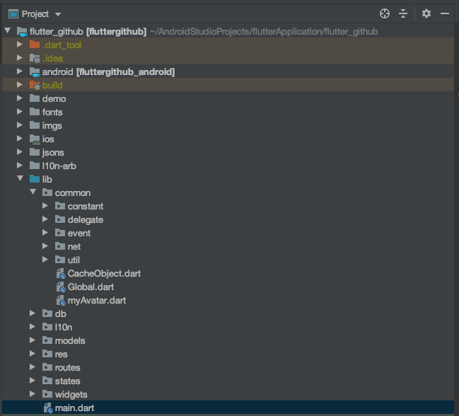
- fonts：自定义的图标文件资源，.ttf格式；

- imgs：图片资源；

- jsons：存放生成Model类的json数据格式

- l10n-arb：多语言相关资源

- lib：
  -- common：存放通用的类。例如全局变量、eventbus、网络请求、常用工具类等。
  -- db：SQLite数据库相关类。

  -- l10n：多语言。

  -- models：jsons文件夹对应的Dart Model实例类。

  --res：资源文件。例如颜色、图片、自定义Icon图标、字体样式等。

  --routes：存放所有页面路由类。

  --states：保存APP中需要跨组件共享的状态类。

  --widges：可复用的、常用的、封装的widget类。

  --main.dart: 程序入口。

## 相关文章
## 第三方框架

## 感谢

## License
```
MrHGJ/FlutterGithub is licensed under the
MIT License

Copyright (c) 2020 MrHGJ

Permission is hereby granted, free of charge, to any person obtaining a copy
of this software and associated documentation files (the "Software"), to deal
in the Software without restriction, including without limitation the rights
to use, copy, modify, merge, publish, distribute, sublicense, and/or sell
copies of the Software, and to permit persons to whom the Software is
furnished to do so, subject to the following conditions:

The above copyright notice and this permission notice shall be included in all
copies or substantial portions of the Software.
```